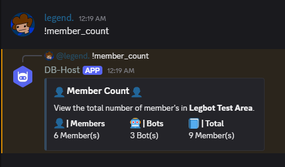
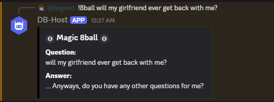

# Discordbot-Host Command Guide
This document explains how to use all available commands in **DB-Host**.

There are currently **28 Commands**, split into 4 categories:
- Moderation
- Utility & Guild
- Fun

> **NOTE:**
> Command names are **not capitalized** when used in discord.

## Command Prefix
All commands use the prefix defined in your `discordbot.config` file.
```bash
PREFIX=!
```
**Command usage:**
```bash
!help
!ban @user <reason> <duration>
```

## Moderation Commands
These commands are intended for server moderation.
Most require moderation permissions to use.

> **IMPORTANT:**  
> When using moderation commands in Discordbot-Host, you **must** provide a reason and/or a time duration for **any moderation action**.

### Duration Format
Time durations follow this format:
`<number>` `<unit>`

**Supported Units:**
- `s` -> seconds
- `m` -> minutes
- `h` -> hours
- `d` -> days
- `w` -> weeks

**Examples:**
- 30m -> 30 minutes
- 6h -> 6 hours
- 7d -> 7 days
- 365d -> 1 year

This format applies only to: **Ban** & **Mute**.

---

### Warn
```bash
# -- format -- #
warn <user> <reason>

# -- example -- #
!warn @user spamming
```

### Kick
```bash
# -- format --#
kick <user> <reason>

# -- example -- #
!kick @user breaking rules
```

### Ban / Unban
```bash
# -- format -- #
ban <user> <reason> <duration>
unban <user>

# -- example -- #
!ban @user raiding 365d
!unban @user
```

### Mute / Unmute
```bash
# -- format -- #
mute <user> <reason> <duration>
unmute <user>

# -- example -- #
!mute @user spamming 1h
!unmute @user
```

### Purge
```bash
# -- format -- #
purge <messages> (1 - 100)

# -- example -- #
!purge 50
```

### Mod Logs
```bash
# -- format -- #
mod_logs <user>

# -- example -- #
!mod_logs @user
```

### Clear Mod Logs
```bash
# -- format -- #
clear_mod_logs <user> <reason> <duration>

# -- example -- #
!clear_mod_logs @user
```

## Utility & Guild Commands
Most Utility & Guild commands are straightforward and require little explanation.

<center>

**Utility & Guild Command Example:**



</center>

## Fun Commands
Fun commands are simple to use. Below is one example.

### 8ball
Ask the magic discordbot a question!
```bash
# -- format -- #
8ball <question>

# -- example -- #
!8ball will my girlfriend ever get back with me?
```

If successful, it will shoot out a randomized answer

<center>

**Example:**



</center>