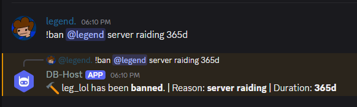

# Discordbot-Host Command Guide
This section explains how to use all available commands in **DB-Host**.

There are currently **30 Commands**, split into 5 categories:
- [Moderation](./MODERATION_COMMANDS.md)
- [Utility, Guild](./GUILD_N_UTILITY_COMMANDS.md)
- [Configuration](./GUILD_N_UTILITY_COMMANDS.md#configuration-commands)
- [Fun](./FUN_COMMANDS.md)

**[Here is a list of the commands.](../README.md#features)**

> **NOTE:**
> Command names are **not capitalized** when used in discord.

## Command Prefix
All commands use the prefix defined in your [`config.json`](../../config.example.json) file.

**Example**:
```json
{
     "PREFIX": "!",
}
```
**Command Usage:**
```bash
!ban @user <reason> <duration>
```
<center>
<strong>Command Example:</strong>

<a href="./images/ban_cmd.png">
     
</a>
</center>
