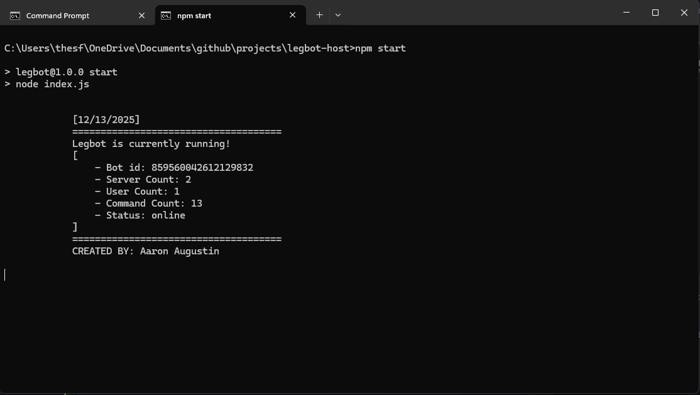

# Building Instructions

## Requirements

You must have [Node.js](https://nodejs.org/en) installed.

To verify the installation, open your command prompt and run:

```
node -v
npm -v
```

**CMD Terminal Example**  


--- 
## Installing Dependencies

After installing Node.js, install the required packages.

Start by running:

```
npm install
```
If a dependecy is missing, you can install it manually using:
```
npm install <package-name>
```
**Example:**
```
npm install discord.js
```

---

## Required Dependencies
- axios
- better-sqlite3
- discord-jokes
- discord.js
- dotenv
- he
- ms
- path
- sqlite3
- winston

--- 

## Running the bot
To start the bot manually, **run either**:

```
npm start
```

or

```
node index.js
```

If everything is set up correctly, you should see a successful startup message in your terminal.

**Successful Compile Example**  

