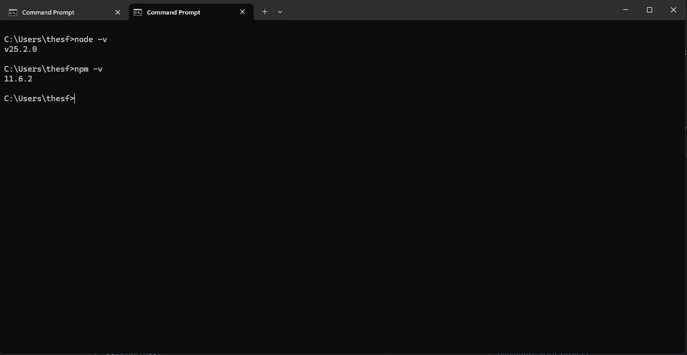
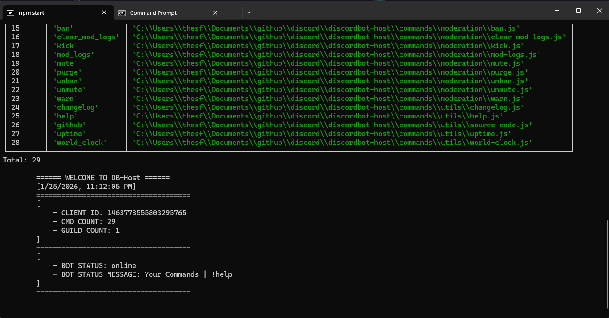

# Locally Compiling your Discord Bot
This document will guide you step-by-step on how to compile your discord bot for local development.

> **IMPORTANT NOTE:**
> **if you haven't already configured your bot (setting up your Bot token, Client ID, etc.), follow the [Configuration Guide](./DISCORD_BOT_CONFIGUATION.md) first, then come back!**

## Requirements
Before you begin, make sure you have these things first.
- **[Node.js](https://nodejs.org/en/download/current)**
     - This is the engine that runs your bot. Make sure you get the **v25 (current)** release for better stability.
- **[Project Dependencies](#included-dependencies)**
     - These are the libraries the bot needs to work. like `discord.js` for the connection and `sqlite3` for the database.

## Installation Steps
### 1. Check your node version
You have to make sure Node is installed correctly. Open your terminal (**Command Prompt**, **Powershell**, or **Bash**) and type:
```bash
node -v
npm -v
```
You should see some version numbers pop up. If you do, you're good to go.

**Terminal Example**


### 2. Navigate your project
Your terminal needs to know exactly where you bot files are located. Use the `cd` (change directory) command to point to your bots folder.

**Example**:
```bash
cd C:\Users\YOURNAME\Documents\MyDiscordBot
```
### 3. Install your packages
Now we need to install the "Project Dependencies" we mentioned in the requirements. In your terminal, run:

```bash
npm install
```
This might take a minute. It's reading the project files and taking each API and dependency the bot needs from the web.
> **Pro Tip:**
> If you ever notice a specific feature isnt working because a package is missing, you can manually install it by typing `npm install <package-name>` (e.g., `npm install discord.js`)

#### Included Dependencies:
- `axios`, `badge-maker`, `better-sqlite3`, `discord-jokes`, `discord.js`, `he`, `ms`, `path`, `sqlite3`, `winston`.

## Running the Bot
Once the installation is complete, your bot is ready to go live! Run either of these commands:
```bash
npm start
```
### OR
```bash
node index.js
```
If successful, your terminal will show the commands being loaded, the database initializing, and a welcome message. Your bot should now be online!

**Successful Startup:**
[](./readme_images/LOCALLY_COMPILE/successful_compile.gif)